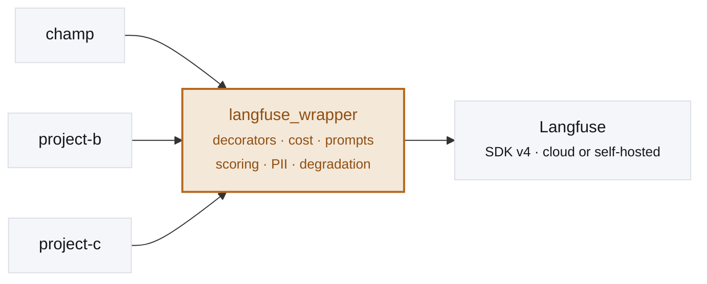

# Proposal: adopt `langfuse_wrapper` as our shared observability layer

**TL;DR** — Instead of writing Langfuse code directly in every project, we adopt one thin,
reusable wrapper library that sits between our projects and Langfuse. Teams instrument with
one-line helpers; when Langfuse changes, one library changes instead of every project.

> A visual one-pager version of this proposal is hosted at
> **[priyanshu-builds.github.io/langfuse_wrapper](https://priyanshu-builds.github.io/langfuse_wrapper/)**
> (source: [`docs/index.html`](index.html)).

## Context

Our early integration wired Langfuse straight into the application. That works for one project,
but it doesn't scale across a company: every project re-solves client setup, "what if the keys
are missing / Langfuse is down", cost tracking, prompt handling, scoring, and PII redaction — and
each solves them slightly differently. When the vendor changes its SDK, every project pays.

`langfuse_wrapper` is a proof-of-concept for the alternative: a single insulating layer.

## The idea

Every project depends on `langfuse_wrapper`. Only the wrapper depends on Langfuse. That single
seam is where SDK details, cost policy, and PII policy live — defined once, inherited by all.



**The one rule that keeps it clean:** projects import `langfuse_wrapper`, never `langfuse`
directly. That guarantees a single client per process, one shared policy, and no cross-project
drift.

## The difference

The same work — a trace, an LLM call, token usage, and a score — written both ways.

### Today: Langfuse in every project

```python
# each project wires up and imports the SDK
from langfuse import get_client, observe
langfuse = get_client()

@observe(name="research_agent", as_type="span")
def run_agent(query):
    with langfuse.start_as_current_observation(
        name="llm-call", as_type="generation", model="claude-opus-4-8",
    ) as gen:
        resp = client.messages.create(...)
        gen.update(usage_details={
            "input": resp.usage.input_tokens,
            "output": resp.usage.output_tokens,
        })
        # cost? PII? by hand, again, here
    langfuse.score_current_trace(name="relevance", value=0.9)
    langfuse.flush()
```

- SDK internals leak into application code
- Repeated — and drifting — in every project
- Langfuse's v3→v4 rewrite would break all of them
- No shared cost, PII, or naming policy

### Proposed: one wrapper, imported

```python
import langfuse_wrapper as lw

@lw.trace(name="research_agent")
def run_agent(query):
    with lw.generation("llm-call", model="claude-opus-4-8") as gen:
        resp = client.messages.create(...)
        lw.track_llm(gen, resp, model="claude-opus-4-8")   # usage + cost
    lw.score("relevance", 0.9)

with lw.trace_context(session_id="s1", user_id="u1", tags=["prod"]):
    run_agent("...")
```

- One import, no SDK internals in app code
- Cost, PII scrubbing, and degradation handled once
- SDK swaps happen inside the wrapper, not the app
- No keys? Every call is a safe no-op — runs unchanged in dev/CI

## Why it pays off

| | |
|---|---|
| **Change once** | Langfuse already shipped a breaking SDK rewrite (v3→v4, OpenTelemetry-based). With direct integration, *every* project rewrites. With the wrapper, only the wrapper does — the same shield if we ever switch observability vendors. |
| **Consistency** | Cost tracking, PII scrubbing, trace naming, and session/user tagging live in the wrapper and apply everywhere, instead of each team re-implementing them (and each getting it subtly wrong). |
| **Velocity** | A developer writes `@lw.trace`, not OpenTelemetry spans. Onboarding a new project to full observability takes minutes. |
| **Safety** | Missing keys or Langfuse down? Every call becomes a no-op and the app runs unchanged — no `if enabled:` branches scattered through product code. |

## Adoption path

1. `pip install` the wrapper from our internal package source (or the git repo for now).
2. Set `LANGFUSE_PUBLIC_KEY` / `LANGFUSE_SECRET_KEY` / `LANGFUSE_BASE_URL` per environment; leave
   them unset in dev/CI so the wrapper no-ops.
3. Replace direct Langfuse calls with `lw.trace` / `lw.generation` / `lw.track_llm` / `lw.score`,
   and wrap request scopes in `lw.trace_context(...)`.

## Proof it's real

Not a sketch — a working library, tested and verified end to end.

- **Features:** tracing (decorators + context managers), LLM usage & cost, prompts (fetch +
  local fallback), scoring, central opt-in PII scrubbing, LangGraph callback handler, cloud or
  self-hosted config, and graceful degradation.
- **Quality:** 78 unit tests (no network), `ruff` + `mypy` clean, CI green on Python 3.10–3.12.
- **Live verification** (`scripts/live_smoke.py`): runs a traced workload against a real Langfuse
  instance **with a second, foreign Langfuse client also in the process** (the case where a host
  app already uses Langfuse), then fetches the trace back through the API and asserts it:

  ```
  [PASS] trace fetched from Langfuse
  [PASS] session / user / tags attached
  [PASS] retrieve span nested
  [PASS] generation + token usage recorded
  [PASS] emits under a foreign client
  ```

## Open questions for the team

- **Distribution:** internal package index (Artifactory / private PyPI / GitHub Packages) vs.
  installing from the git repo.
- **Versioning:** semver policy, since multiple projects will pin to it.
- **Scope:** which additional helpers (e.g. more model prices, dataset/eval runners) belong in the
  shared layer vs. individual projects.
